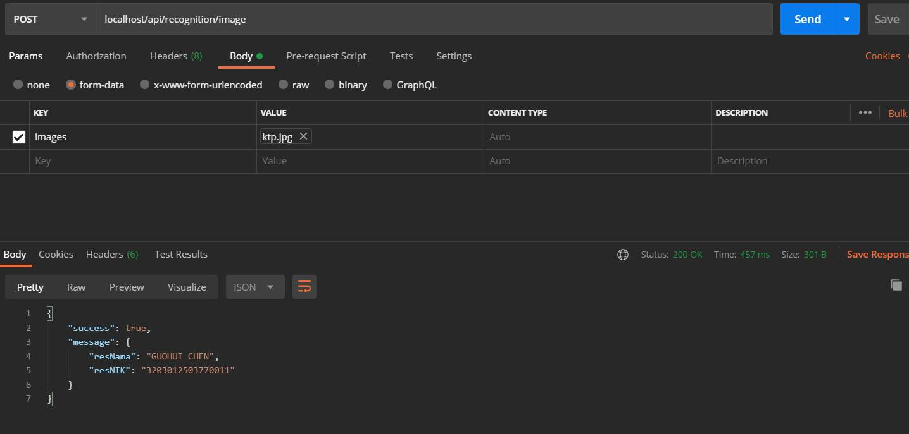

# KTP Validation Image
KTP Validation Using OCR

## Reference using Python
[https://github.com/muhammadzakirramadhan/ktp-validation](https://github.com/muhammadzakirramadhan/ktp-validation)

## Preview


## Installation

* Clone the Repo
* Install all library needed to environment by using command
```bash
npm install
```

## Usage

* Start server with command:
```bash
node index.js
```

Then open [http://127.0.0.1:80/](http://127.0.0.1:80/)

## API

| Url        | Params           | Type |
| ------------- |:-------------:| :-----:| 
| /api/recognition/image | images | Files | 
